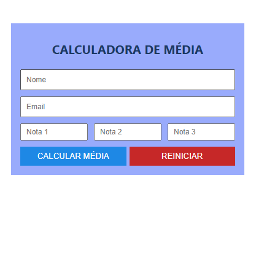

# Calculadora de Média em React

## Sobre o Projeto

Aplicação desenvolvida em React para cálculo da média de três notas.

O usuário informa seu nome, e-mail e notas, e o sistema calcula e exibe a média juntamente com os dados cadastrados.

## Funcionalidades

* Cadastro de nome e e-mail.
* Inserção de três notas.
* Validação de campos obrigatórios.
* Cálculo da média aritmética.
* Exibição dos dados informados.
* Limpeza dos campos através do botão Reiniciar.

## Tecnologias Utilizadas

* React
* JavaScript
* HTML
* CSS (estilos incorporados ao componente)

## Autor

Vania Godoy

Projeto desenvolvido para fins acadêmicos na disciplina de Desenvolvimento Multiplataforma 2 do curso de Desenvolvimento 
de Sistemas para Dispositivos Móveis IFSP - São Carlos
